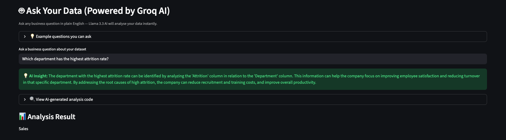
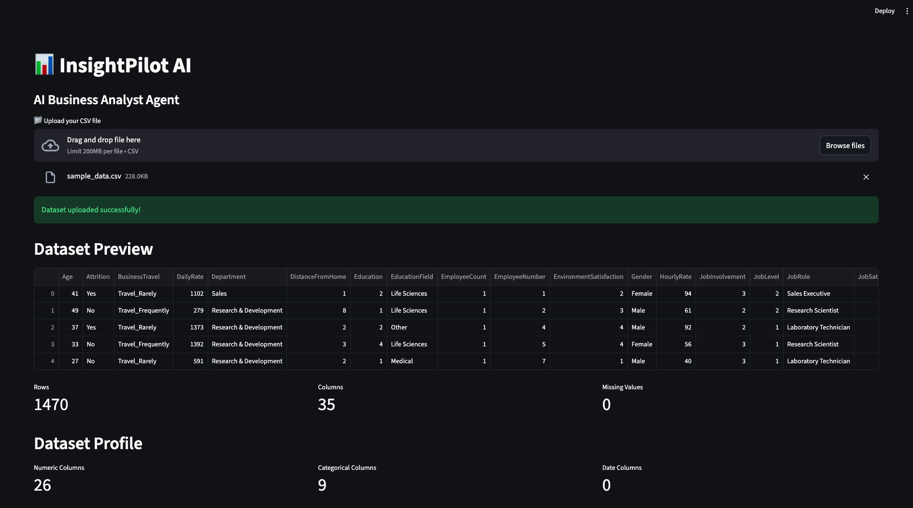
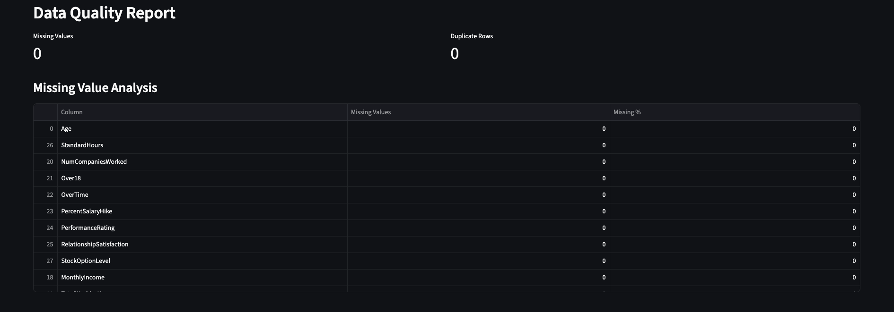
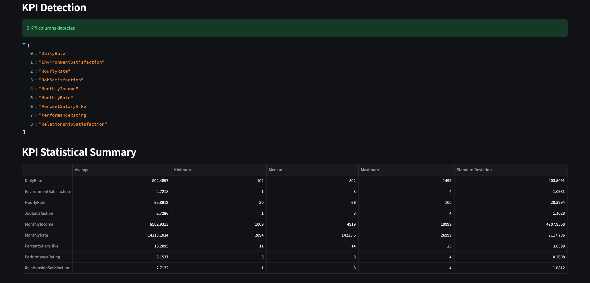
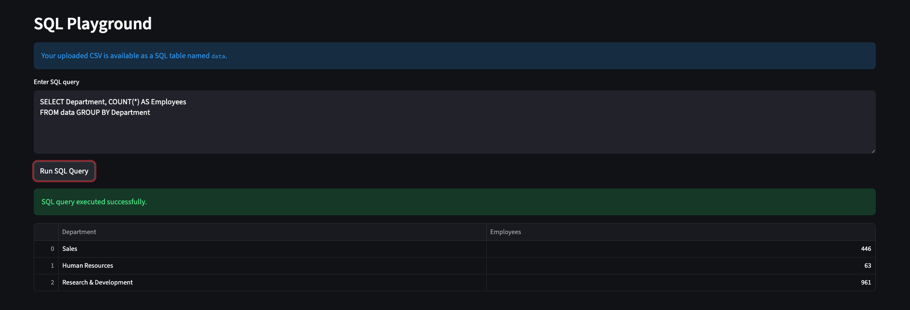

# InsightPilot AI — AI-Powered Business Analyst Agent

An AI-powered data analysis tool that lets you upload any CSV dataset 
and ask business questions in plain English. 
Powered by Groq/Llama 3.3 AI.

---
## 📸 Screenshots

### Dataset Upload & Preview


### Dataset Profile & KPI Summary


### Data Quality Report


### SQL Playground


### AI Answering Business Questions


---

## Features
- Upload any CSV dataset — drag and drop
- Automatic data profiling — rows, columns, missing values
- KPI detection and statistical summary
- SQL Playground — run queries directly on your data
- AI-powered Q&A — ask any business question in plain English
- AI generates and executes real pandas code automatically
- Works with any dataset — HR, sales, finance, operations

---

##  Tools & Technologies

| Tool | Purpose |
|---|---|
| Python | Core language |
| Streamlit | Web application framework |
| Pandas | Data manipulation |
| DuckDB | In-memory SQL engine |
| Groq API | LLM inference engine |
| Llama 3.3 70B | AI language model |

---

## How to Run Locally

1. Clone the repo:
```bash
git clone https://github.com/VinitBhalerao3012/insightpilot-ai.git
cd insightpilot-ai
```

2. Create virtual environment:
```bash
python -m venv venv
source venv/bin/activate
```

3. Install dependencies:
```bash
pip install -r requirements.txt
```

4. Get a free API key from console.groq.com

5. Set your key:
```bash
export GROQ_API_KEY=your_key_here
```

6. Run the app:
```bash
python -m streamlit run app.py
```

7. Open browser at http://localhost:8501

---

## Example Questions You Can Ask
- Which department has the highest attrition rate?
- What is the average monthly income by job role?
- How many employees work overtime?
- What percentage of employees left the company?
- Which job role has the lowest job satisfaction?
- What is the average age of employees who left vs stayed?
- Show top 5 departments by average salary

---

## Project Structure
...
insightpilot-ai/
│
├── app.py                 (Main Streamlit application)
├── requirements.txt       (Python dependencies)
├── .gitignore            (Git ignore file)
├── assets/               (Screenshots)
│   ├── S1.png
│   ├── S2.png
│   ├── S3.png
│   ├── S4.png
│   └── S5.png
└── README.md
...

---

## Author

**Vinit Bhalerao**
Data Analyst | Python | SQL | Power BI | AI

[](https://linkedin.com/in/bhalerao-vinit3013)
[](https://vinitbportfolio.netlify.app)
[](https://github.com/VinitBhalerao3012)